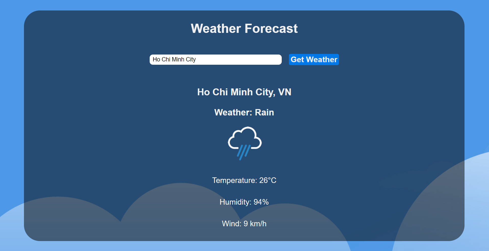

# Weather-Forecast-Website
## Introduction
This is a simple website made in HTML, CSS, and JavaScript. Enter your city name and the current weather will be displayed.
## Website interface
  
To see the website fully, you can download this project and open index.html file or click [HERE](https://simpleweatherforecast.netlify.app/).  
### Favicon icon and background image taken from this website: https://www.freepik.com
### Icons file taken from this project: https://github.com/CodeExplainedRepo/Weather-App-JavaScript  